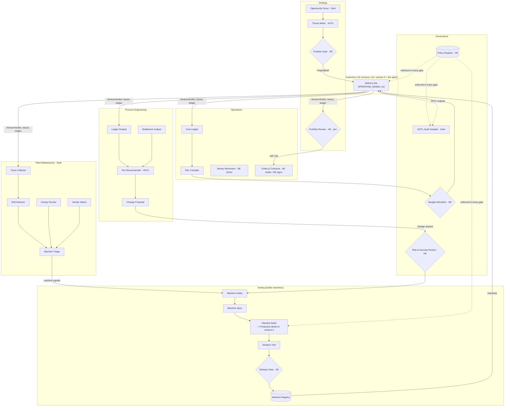

# Level 0 — The Plant

The company is a plant that runs many product lines (ventures), **designs and builds its own machines** (agents, workflows, contracts, verifiers, gates), maintains them, improves its own process from measured evidence, and decides which lines to run. `OPERATING_MODEL.md` describes one product line. This document describes the plant that operates it.

The plant follows the same rules as every level below it: nodes with contracts, edges only where data flows, methods on every node, gates where a human decides. The five-row table governs how the company runs, not just how widgets get built.

## 0. Three facts that shape everything

1. **The unit is the venture.** Each venture is an instance of the Production line (`OPERATING_MODEL.md`) with its own Brief, budget, ledger, and P&L. The plant is a portfolio.
2. **The plant is self-hosting.** A new workflow, lens, contract, or gate is a `WorkItem` with `source = tooling`, built on the Production line against the plant's own repo (**venture 0**), verified by machine-specific lenses, trialed in shadow, and released into the Machine Registry. The factory builds its own machines on its own line.
3. **The human roster is one, and he is a Direct Driver only where a body or a signature is required.** Everything else is AE. The human's surface area (§8) is the org chart.

## 1. Plant functions (Level 0 nodes)

| Function | Purpose | Receives | Produces | Dominant method |
|---|---|---|---|---|
| **Strategy** | Decide which ventures to run, fund, and stop | market signals, `VentureVerdict[]`, capital, thesis | `ProjectBrief` (new venture), portfolio decisions | AE scouts, HE decides [HITL] |
| **Production** | Run a venture's product line (§OPERATING_MODEL) | `ProjectBrief`, machines from Registry | live product, `EvidenceBundle[]`, `VentureVerdict`, run traces | AE [HOTL] |
| **Tooling** (industrial engineering) | Design and build the machines | machine requests | released machines in the Registry | AE [HOTL], HE at release gate |
| **Plant Maintenance** | Keep machines healthy across all ventures | run traces, vendor signals, canary results | machine signals → Tooling; calibration | AE [Dark Factory] |
| **Process Engineering** | Improve the operating model from evidence | Method Ledger, traces, gate logs | operating-model change proposals, tier moves | AE analyses, HE decides [HOTL→HITL] |
| **Operations** | Run the business: money, legal, vendors, people, clients | ledgers, contracts, invoices, hiring needs | P&L per venture, signed instruments, accounts | AE drafts [Dark/HOTL], HE signs [Direct Driver] |
| **Governance** | Set and enforce the rules the plant runs under | policies, budgets, risk reviews, audits | policy registry, budget allocations, audit findings | HE authors [Direct Driver], AE enforces [Dark Factory] |
| **Plant Knowledge** | The plant's memory: registry, ledger, patterns | every artifact | queryable state for every function | AE [Dark Factory] sink |

## 2. Level 1 inside each function

### 2.1 Strategy

| Node | Receives | Produces | Executor [Method] | Waits on |
|---|---|---|---|---|
| Opportunity Scout | thesis, constraints, market/web signals | opportunity memos | AE [Dark] | nothing — continuous |
| Thesis Writer | one memo, Plant Knowledge (what's worked) | Venture Thesis (problem, wedge, kill criteria, budget ask) | AE [HOTL] | Scout |
| Portfolio Gate | Venture Thesis[], capital available, portfolio state | approve → `ProjectBrief`; defer; kill | HE [HITL] | batched |
| Portfolio Review | all `VentureVerdict[]`, P&L per venture, capital | keep / sell / kill / pivot per venture; reallocation | AE compiles, HE decides [HITL] | periodic **join** |
| Client-mode Decision | portfolio maturity, Production metrics | open to external clients: yes/no, terms | HE [Direct Driver] | on Review |
| Sell Execution | sell decision | buyer search, data room, deal | AE prepares [HOTL], HE signs [Direct Driver] | on sell |

### 2.2 Tooling (builds the machines) — self-hosted on Production

| Node | Receives | Produces | Executor [Method] | Waits on |
|---|---|---|---|---|
| Machine Request Intake | Process Eng proposals, Maintenance signals, venture needs, escalation patterns | `WorkItem` (source=tooling, kind=workflow/agent/contract/lens/gate) | AE [Dark] | nothing |
| Machine Spec | `WorkItem` | `Spec` + machine-specific acceptance: contract compatibility, replayability, cost ceiling, safety tier | AE [HOTL] | Intake |
| **Machine Build** | `Spec` | verified change to venture 0 repo | **Production.Build on venture 0** | Spec |
| Machine Lenses | change set | verdicts: `contract_compat`, `replayable` (no forbidden calls, deterministic), `cost_profile`, `safety_tier` (may this run Dark Factory?) | AE cheap [Dark] | in Build's Verifier Panel |
| Shadow Trial | built machine, one live venture | trial report: new vs current on the same inputs | AE [HOTL] | Build pass |
| Machine Release Gate | trial report, safety tier | release / reject | HE [HITL] | Trial |
| Registry Publish | released machine | Machine Registry entry (version, contracts in/out, method tier, cost profile, owner) | AE [Dark] | Gate |

Machine lenses are added to the Verifier Panel automatically when `WorkItem.source == tooling`. This is the only place Production behaves differently for the plant than for a venture.

### 2.3 Plant Maintenance — Dark Factory

| Node | Receives | Produces | Waits on |
|---|---|---|---|
| Trace Collector | every workflow run's trace (tokens, latency, escalations, gate outcomes, lens verdicts) | normalized machine telemetry | continuous |
| Drift Detector | telemetry vs baseline per machine; model/version changes | machine signals (regression, cost spike, schema violations rising) | Collector |
| Canary Runner | known-defect library, golden runs | catch-rate per lens; replay diffs | scheduled — ∥ Drift |
| Vendor Watch | model releases, deprecations, price changes, API changes | vendor signals | continuous — ∥ everything |
| Calibrators | ledger + downstream defects | lens calibration, estimate calibration | periodic |
| Machine Triage | any signal | severity + affected machines → Tooling intake or hotfix | signals |

No barrier anywhere. Same shape as venture Maintain, pointed at machines instead of products.

### 2.4 Process Engineering — the autonomy-ladder loop

| Node | Receives | Produces | Executor [Method] | Waits on |
|---|---|---|---|---|
| Ledger Analyst | Method Ledger (work type × method × cost × human minutes × downstream defects) | findings: where each method earns its keep | AE [Dark] | periodic |
| Bottleneck Analyst | traces: barrier wait, gate latency, false edges (chained agents with no data crossing) | topology findings | AE [Dark] | ∥ Ledger |
| Tier Recommender | findings, policy registry | proposals: move node X from HITL→HOTL (evidence: N clean batches), or HOTL→HITL (defect rate) | AE [HOTL] | both analysts **join** |
| Operating Model Change Proposal | proposal, expected savings, risk | change request → Governance gate → Tooling intake | AE [HOTL] | Recommender |

This is the mechanism by which the company climbs toward the green rows **with evidence rather than optimism**. Gates get removed when the ledger proves they stopped catching anything; they get added back when defects rise.

### 2.5 Operations

| Node | Receives | Produces | Executor [Method] | Human required because |
|---|---|---|---|---|
| Cost Ledger | tokens, cloud, vendors, tools — per venture and per plant function | cost lines | AE [Dark] | — |
| P&L Compiler | cost lines, revenue | P&L per venture, plant overhead | AE [Dark] | — |
| Money Movement | invoices, payments, payroll, purchases | executed transactions | HE [Direct Driver] | **physically required** (accounts, banking) |
| Entity & Contracts | new venture, sale, client, vendor | drafted instruments | AE drafts [HOTL] → HE signs [Direct Driver] | **signature required** |
| Credential Custody | accounts, keys, domains, model providers | access grants | HE [Direct Driver] | **physically required** |
| Vendor Management | vendor signals from Maintenance | renew / switch / negotiate | AE recommends [HOTL], HE decides | — |
| People | roles that need a second human (§8), onboarding | role definition as graph nodes, access | HE [Direct Driver] | hiring is a human act |
| Client Ops | external prospects (once Client-mode = yes) | Intake → Scope, as in Production | HE+HC [Direct Driver] | relationship |

### 2.6 Governance

| Node | Receives | Produces | Executor [Method] |
|---|---|---|---|
| Policy Registry | HE decisions | rules: which node kinds may run Dark Factory; data classes; spend ceilings; security baseline; what always needs a human | HE authors [Direct Driver], AE enforces [Dark] |
| Budget Allocation | P&L, portfolio decisions | budgets per venture and per plant function | AE proposes [HOTL], HE approves [HITL] |
| Risk & Security Review | machine releases touching safety tier; venture launches touching data/payments | approve / conditions | HE [HITL] |
| HOTL Audit Sampler | all HOTL outputs across the plant | random sample to human review queue; audit findings | AE [Dark] samples, HE reviews |
| Plant Incident Review | sev1s across ventures, machine outages | postmortems → Process Eng and Tooling | AE drafts [HOTL], HE signs off |

The HOTL Audit Sampler is what keeps "on the loop" from silently becoming "off the loop": a fixed sample of autonomous outputs always reaches a human, and the sample rate is itself a policy that Process Engineering can propose changing.

## 3. Level 0 dependencies

- **Chains:** Scout → Thesis → Portfolio Gate → Production. Intake → Machine Spec → Machine Build → Shadow Trial → Release Gate → Registry. Analysts → Recommender → Change Proposal → Governance → Tooling Intake.
- **Independent / parallel:** every venture's Production line; Plant Maintenance nodes; Vendor Watch; Ledger and Bottleneck analysts; Cost Ledger and P&L.
- **Joins:** Portfolio Review (all VentureVerdicts + P&L); Tier Recommender (both analysts); Budget Allocation (P&L + portfolio decisions); Machine Release Gate (trial + safety tier).
- **Three loops that make it a company, not a pipeline:**
  1. **Portfolio loop** — Strategy → Production → VentureVerdict → Portfolio Review → Strategy. Converges by kill criteria and capital.
  2. **Machine loop** — Maintenance/Process Eng → Tooling → Production.Build (venture 0) → Trial → Registry → every venture. Converges by Release Gate and cost ceilings.
  3. **Autonomy loop** — Ledger → Tier Recommender → Governance → gate config. Converges by evidence thresholds in policy.

## 4. Diagram

## 5. The plant as venture 0

Bootstrapping is not a special case. The plant's own repo (`CLAUDE.md`, `OPERATING_MODEL.md`, `contracts.schema.json`, `.claude/workflows/`, `substrate/`) is venture 0:

- Its **Brief**: build a plant that can run venture 1 with the human surface in §8 and no other human touches. Kill criteria: cost per shipped spec above X; escalation rate above Y after N iterations.
- Its **backlog**: the phases in `HANDOFF.md`, as `WorkItem`s with `source = tooling`.
- Its **Production line**: `/build-spec` and `/build-implement` run on itself.
- Its **Maintain**: Plant Maintenance. Its **Improve**: Process Engineering. Its **VentureVerdict**: whether the plant is ready to run venture 1.

The first machines the plant builds are the rest of its own machines. That's the self-hosting loop closing for the first time.

## 6. Venture lifecycle through the plant

Thesis → Portfolio Gate → `ProjectBrief` → Entity & Contracts (if needed) → Budget Allocation → Production (create → build → launch → maintain ↔ improve) → `VentureVerdict` → Portfolio Review → keep (loop) / sell (Sell Execution) / kill (wind-down: Ops closes accounts, Knowledge archives patterns) / pivot (new Brief, same entity).

## 7. Plant-level contracts (to add to `contracts.schema.json`)

`VentureThesis`, `PortfolioDecision`, `MachineRequest` (extends `WorkItem`), `MachineRegistryEntry`, `MachineSignal`, `TrialReport`, `MethodLedgerRow`, `TierProposal`, `Policy`, `BudgetAllocation`, `AuditFinding`, `CostLine`, `PnL`.

## 8. The human's complete surface area (the org chart of one)

**Direct Driver — a body or signature is required:**
Money Movement · Entity & Contracts signing · Credential Custody · Policy authoring · People (hiring/onboarding) · Client relationship (once open) · Sell Execution closing

**Supervisory — HITL gates, batched, in chat:**
Portfolio Gate · Portfolio Review · Budget Allocation · Machine Release Gate · Risk & Security Review · Spec Gate (high-risk) · Launch approval · Roadmap Gate · Venture Verdict · Sev1 page · Ratio Gate · Fix-loop escalations · HOTL audit samples

**Everything else is AE.** Process Engineering's job is to shrink the second list over time with evidence, and Governance's job is to make sure the first list never shrinks by accident.

## 9. When a second human joins

A role is a set of nodes reassigned from `HE = founder` to `HE = <person>`. The graph does not change; the executor column does. First candidates, by evidence: whichever HITL gate has the highest latency in the Bottleneck Analyst's findings, or Client Ops when Client-mode flips to yes.
