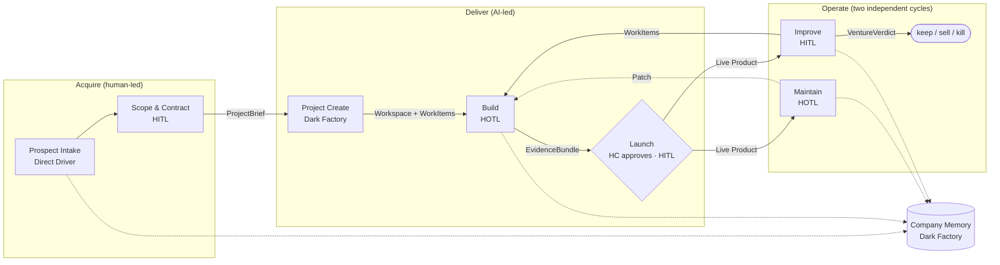
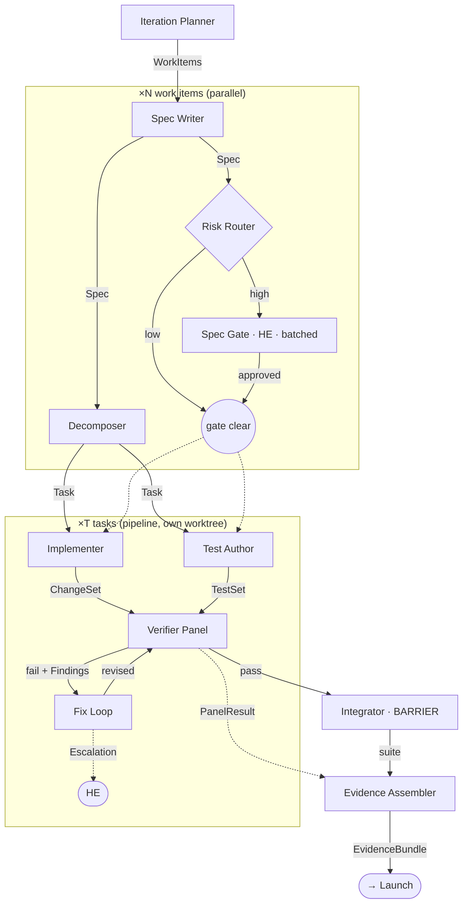
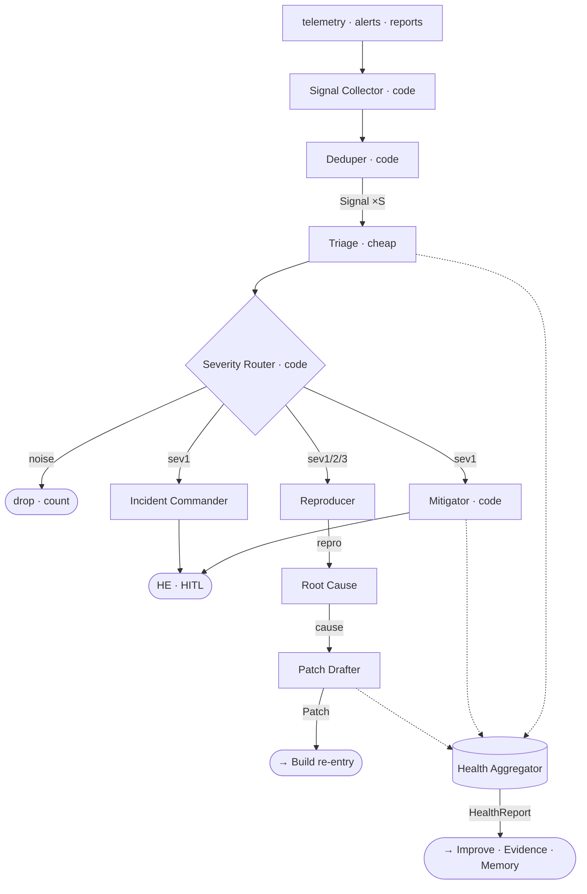

# Company Super Graph — Operating Model

**Purpose:** a software company designed as a dependency graph. Every unit of work is a node with a contract; every arrow is data that actually flows; every node is executed by a human employee (HE), an AI agent employee (AE), or a human client (HC) under one of five working methods. This document is the handoff to Claude Code: build the orchestration, then run a self-owned venture through it end to end.

**Companion files:** `CLAUDE.md` (rules for Claude Code), `contracts.schema.json` (every edge shape), `HANDOFF.md` (phases and prompts), `.claude/workflows/` (build-spec, build-implement).

---

## 0. Foundations

### 0.1 Working methods (the vocabulary — intentionally non-standard)

| Method | AI role | Human role | Runtime behavior the orchestrator must implement |
|---|---|---|---|
| **Dark Factory** | Full autonomy | None | Run. No notification unless budget or failure threshold is breached. |
| **HOTL** (preferred) | Acts autonomously | Audits, can veto | Run. Emit result to the review queue with a veto window. Proceed past the window; a veto fires the node's rollback edge. |
| **HITL** | Executes, pauses for approval | Approves | Block on a gate. Gates batch. A gate timeout **escalates**, never auto-approves. |
| **Direct Driver** | Copilot | In command | Human performs the node with AI tools; orchestrator records provenance only. |
| **Human** | None | Full | Manual. Record only. |

Goal is not maximum autonomy; it is routing each node to the method that extracts the most value. Every artifact carries `provenance.method` so Company Memory can later measure which method earned its keep on which kind of work.

### 0.2 Graph rules (from the source article, adopted as law)

1. **An edge exists only if a variable crosses it.** "And then" is not a dependency.
2. **Every node has a contract:** explicit inputs, schema-validated outputs, one job. Validation happens at the tool layer; mismatch = retry, never free text downstream.
3. **Edges are code.** Flatten, dedupe, route, merge, aggregate: deterministic, zero tokens. Agents are for judgment only.
4. **Fresh context per node.** Nodes receive precisely their contract inputs. Nothing is inherited from a shared session window. Large things are passed by reference (`*_ref`), never inlined.
5. **Pipeline by default; barrier only when a stage truly needs every prior result.**
6. **Isolate writers.** Any node that writes files runs in its own git worktree.
7. **Cycles must converge:** a seen-set that includes rejected items, a round cap, a budget cap, and an escalation edge.
8. **Verifiers sit on edges** and are designed to reject.
9. **Tier models.** Bounded/repetitive nodes on cheap models; judgment nodes on strong ones.

### 0.3 Four questions, asked of every node

What does it receive? What does it produce? What tools/context does it need? Can it run without waiting for others? Every table below is the answer.

### 0.4 The human's entire surface area

With a day-one roster of one, this list is the job description. Everything not on it is AE.

| Gate | Where | Method | Trigger | Human action |
|---|---|---|---|---|
| Brief approval | Scope & Contract | HITL | every new project | sign / revise |
| Spec Gate | Build | HITL | `spec.risk == high` only, batched | approve / revise / kill |
| Fix Loop escalation | Build | HOTL | convergence failure | guide / direct-drive / kill to spec |
| Ratio Gate | Build re-entry | HITL | maintain share crosses threshold for 2 iterations | adjust |
| Sev1 page | Maintain | HITL | sev1 classified (mitigation already applied) | keep / lift mitigation |
| Launch approval | Launch | HITL | every release candidate | approve / veto (HC) |
| Roadmap Gate | Improve | HITL | every improve cycle | approve backlog / close |
| Venture Verdict | Improve | HITL | periodic + kill-criteria hit | keep / sell / kill / pivot |
| HOTL veto window | any HOTL node | HOTL | passive | veto optional |

---

## 1. Level 1 — The company

### 1.1 Nodes

| Node | Receives | Produces | Tools / context | Executor [Method] | Waits on |
|---|---|---|---|---|---|
| Prospect Intake | Lead | Qualified Prospect / Decline | CRM, rubric | HE+HC [Direct Driver] | nothing — continuous |
| Scope & Contract | Qualified Prospect (or self-idea) | `ProjectBrief` (signed) | templates, estimate calibration from Memory | HE+HC, AE drafts [HITL] | Intake |
| Project Create | `ProjectBrief` | `Workspace` (incl. seeded backlog) | provisioning APIs | AE [Dark Factory] | Brief |
| Build | `Workspace`, `WorkItem[]` | `EvidenceBundle` (release candidate) | §2 | AE [HOTL] | Workspace + WorkItems |
| Launch | `EvidenceBundle` | `LaunchRecord`, Live Product | deploy pipeline | AE executes, HC approves [HITL] | **sync** |
| Maintain | Live Product, telemetry | `Patch[]` → Build, `HealthReport` | §4 | AE [HOTL], sev1 → HITL | Launch; then continuous |
| Improve | telemetry, client feedback, `HealthReport`, budget | `WorkItem[]` (source=improve), `VentureVerdict` | §5 | AE proposes, HE/HC decide [HITL] | Launch; **not** Maintain |
| Company Memory | any output | patterns, calibration, canaries | memory store | AE [Dark Factory] | nothing — sink |

### 1.2 Dependencies

- **Chain (per project):** Intake → Scope → Create → Build → Launch. Real data at every arrow.
- **Parallel:** projects are independent graphs; Maintain ∥ Improve after launch; Intake runs regardless; Memory never blocks.
- **Sync points:** Launch (candidate + evidence + approval); **Build re-entry** (Patches from Maintain and WorkItems from Improve converge — see §3).
- **Cycles:** Improve → Build → Launch → Improve, and Maintain → Build → Launch → Maintain. Both converge on business rules (§5.3), not code.

### 1.3 Diagram



### 1.4 Self-owned ventures

Business model is both services and own products, starting with own products where the founder is HE *and* HC. The graph does not fork: Scope & Contract becomes a Brief-writing node (AE drafts from a one-paragraph idea; founder signs), and Launch/Roadmap approvals are the founder acting as HC. `ProjectBrief.client = "self"` and `ProjectBrief.kill_criteria` are what make "prove the process, then sell/keep/kill" mechanical rather than emotional.

---

## 2. Level 2 — Build

**Contract:** receives `Workspace`, `WorkItem[]`; produces `EvidenceBundle`.

### 2.1 Nodes

| Node | Receives | Produces | Tools / context | Executor [Method] | Waits on |
|---|---|---|---|---|---|
| Iteration Planner | `WorkItem[]`, capacity budget | selected `WorkItem[]` | backlog, repo map | AE [Dark] | nothing |
| Spec Writer ×N | `WorkItem` | `Spec` | read repo, docs, Memory patterns | AE [HOTL] | Planner |
| Risk Router ×N | `Spec` | `spec.risk` + reasons | none, cheap model | AE classifies, code branches [Dark] | Spec only |
| Decomposer ×N | `Spec` | `TaskGraph` | repo map, ownership rules | AE [Dark] | Spec only — **parallel to Router** |
| Spec Gate | high-risk `Spec` + `TaskGraph`, batched | approved / revised / killed | — | HE [HITL] | Router |
| Implementer ×T | `Task`, `Spec` | `ChangeSet` | own worktree, local tests | AE [HOTL] | Task + gate-clear |
| Test Author ×T | `Task`, `Spec` | `TestSet` | own worktree | AE [HOTL] | Task + gate-clear — **not Implementer** |
| Verifier Panel ×T | `ChangeSet`, `TestSet`, `Spec` | `PanelResult` | §2.4 | AE ×lenses, cheap [Dark] | **sync** |
| Fix Loop ×T | `ChangeSet`, `Finding[]`, seen-set | revised `ChangeSet` / `Escalation` | §2.5 | AE [HOTL] → HE on escalate | cycle |
| Integrator | all passing `ChangeSet[]` | integrated build, suite results | merge, full CI; AE only on conflict | code [Dark] | **barrier** |
| Evidence Assembler | `PanelResult[]` (streamed), suite results | `EvidenceBundle` | none | AE [Dark] | accumulates; finalizes on Integrator |
| Build Memory | any | patterns, calibration | memory store | AE [Dark] | sink |

### 2.2 Dependencies

- **Chain (per task):** Decomposer → Implementer → Verifier → Fix Loop → Integrator.
- **Parallel:** Specs ×N; Router ∥ Decomposer; Implementer ∥ Test Author (both consume only Spec+Task); Implementers ×T in worktrees; lenses ×4; Memory.
- **Sync points:** Verifier Panel (per task), Spec Gate (per batch, human), Integrator (per iteration — the only true barrier).
- **Human touchpoints:** two. Spec Gate for high-risk only; Fix Loop escalations. Everything else surfaces in the EvidenceBundle at Launch.

### 2.3 Diagram



### 2.4 Level 3 — Verifier Panel

**Contract:** `ChangeSet`, `TestSet`, `Spec` → `PanelResult`. Lenses get **different inputs**, not just different prompts.

| Node | Receives | Produces | Tools | Waits on |
|---|---|---|---|---|
| Test Runner | `ChangeSet`, `TestSet` | test results + criteria coverage | sandbox — **code, 0 tokens** | nothing |
| Spec Conformance lens | `Spec`, diff only | `Verdict` | none | nothing |
| Correctness lens | `Spec`, `TestSet`, test results | `Verdict` | read repo | Test Runner |
| Security lens | diff, `spec.touched_surfaces` | `Verdict` | read repo, secrets scanner | nothing |
| Blast Radius lens | diff, symbol/call graph | `Verdict` | call-graph tool | nothing (defer until repo is large) |
| Adjudicator | all `Verdict[]` | `PanelResult` | **code** | sync |
| Tiebreak Judge | `Verdict[]`, diff, `Spec` | `Verdict` | strong model | only on split |

**Adjudication (code):** Security fail = panel fail (veto). Otherwise majority of remaining; 2–1 with swing-vote confidence < 0.7 → Tiebreak. Findings deduped on `dedupe_key`; open findings go to Fix Loop with lens attached.

**Anti-rubber-stamp:**
1. Adversarial framing — every lens is told to reject; `Verdict.attempts` requires ≥3 entries or the tool layer rejects it.
2. Information asymmetry — lenses never see `ChangeSet.notes`. Orchestrator strips it when building lens inputs.
3. Model separation — lenses run on a different model/temperature from the Implementer.
4. Canary mutations — Memory periodically injects a known defect into a change set pre-verification; a lens that passes a canary is flagged and its prompt goes to the human review queue.
5. Calibration — lens pass rates correlated against defects Maintain later finds. A lens that passes everything and catches nothing is measurably broken.

### 2.5 Level 3 — Fix Loop

**Contract:** `ChangeSet`, `Finding[]`, seen-set → revised `ChangeSet` (→ Verifier) or `Escalation` (→ HE).

| Node | Receives | Produces | Tools | Waits on |
|---|---|---|---|---|
| Finding Triage | `Finding[]`, seen-set | Fresh / Repeat / Contested | **code** | nothing |
| Fix Planner | Fresh, `Spec`, diff | fix plan (action + owned surfaces per finding) | read repo | Triage |
| Fixer ×F | one plan item, worktree | patch | own worktree, local tests | parallel across disjoint surfaces |
| Dispute Checker | Contested, `Spec`, diff | uphold / overrule | strong model | parallel to Fixers |
| Patch Merger | patches | revised `ChangeSet` (revision+1) | **code**; AE on conflict | join |
| Budget Governor | round, spend, Repeat | continue / escalate | **code** | nothing |
| Escalation Packager | history, Repeat, disputes lost | `Escalation` | none | on escalate |

**Convergence (code, checked before every round):**
- Panel pass → exit to Integrator.
- Round ≥ K (start K=3) → escalate.
- Same `dedupe_key` repeats twice → escalate immediately.
- Task token budget exceeded → escalate.
- Fresh empty but panel still fails → escalate (`no_fresh_findings`).
- **Seen-set includes everything ever raised**, fixed or overruled. Otherwise the loop rediscovers dead ends forever.

Fixers see `finding.location` and `finding.evidence` but not the lens's full reasoning — a fixer that reads the argument patches the argument. Disputes go to the Dispute Checker, never back to the same lens; overruled findings are marked and added to seen.

### 2.6 Model tiering for Build

| Tier | Nodes |
|---|---|
| Strong | Spec Writer, Tiebreak Judge, Dispute Checker, Escalation Packager, Integrator conflict resolution |
| Mid | Implementer, Test Author, Fixer, Fix Planner |
| Cheap | Risk Router, Decomposer, all four lenses, Iteration Planner |
| Code (0 tokens) | Test Runner, Adjudicator, Triage, Patch Merger, Budget Governor, Integrator merge, all edges |

---

## 3. Level 3 — Build re-entry (the Maintain/Improve merge)

**Contract:** `Patch[]`, `WorkItem[]` (source=improve), capacity, `HealthReport` trend → ordered `WorkItem[]` → Iteration Planner.

| Node | Receives | Produces | Tools | Waits on |
|---|---|---|---|---|
| Patch Classifier ×P | `Patch` | `patch.urgency` + conflict surfaces | read repo | nothing |
| Hotfix Lane | hotfix `Patch` | `WorkItem` (source=hotfix) → Implementer directly | **code** | nothing — bypasses queue |
| Conflict Detector | routine `Patch[]`, `WorkItem[]` | overlap map on `Surface` | symbol graph — **code** | both inputs |
| Budget Splitter | capacity, `HealthReport.trend` | maintain:improve ratio | **code**, rule-based | nothing |
| Ratio Gate | ratio outside guardrail | adjust | — HE [HITL] | on breach only |
| Merge Planner | routine patches, work items, overlap map, ratio | ordered `WorkItem[]` | none | **sync** |

**Rules:** hotfixes pre-empt and skip the sync point; overlap forces patch-before-feature within one iteration, nothing else forces order; ratio defaults 20/80 and shifts automatically with health trend, escalating only when maintain share > 50% for two iterations; any item with `deferred_iterations ≥ N` is listed in `EvidenceBundle.starved_items`.

---

## 4. Level 2 — Maintain

**Contract:** Live Product, telemetry → `Patch[]` (→ Build re-entry), `HealthReport`. Continuous; runs per signal, not per batch. **No barrier anywhere in this node.**

| Node | Receives | Produces | Tools | Executor [Method] | Waits on |
|---|---|---|---|---|---|
| Signal Collector | raw telemetry, alerts, errors, user reports | `Signal[]` | monitoring, error tracker, support channel — **code** | [Dark] | continuous |
| Deduper | `Signal[]`, known-issues set | fresh `Signal[]` | **code** | [Dark] | nothing |
| Triage ×S | `Signal` | `Triage` | read repo, runbooks, cheap model | AE [Dark] | per signal |
| Severity Router ×S | `Triage` | sev1 / sev2 / sev3 / noise | **code** | [Dark] | Triage |
| Mitigator | sev1 `Triage` | rollback / flag flip / scale | deploy pipeline — **code** | [Dark], reversible | **parallel to RCA, before human** |
| Incident Commander | sev1 `Triage` | incident record, page HE | comms, status page | AE → HE [HITL] | Router |
| Reproducer ×S | sev1–3 `Triage` | repro (failing test / steps) or `cannot_repro` | sandbox | AE [HOTL] | Triage |
| Root Cause Analyst ×S | repro, diff history | cause (location, hypothesis, confidence) | read repo, git log | AE [HOTL] | Reproducer |
| Patch Drafter ×S | cause, `Spec` of affected surface | `Patch` (change set + regression test) | own worktree | AE [HOTL] | RCA |
| Health Aggregator | all `Triage`, mitigations, patches, SLO metrics | `HealthReport` | **code**, on cadence | [Dark] | sink |

**Rules:** no `Patch` without `repro.status`; `cannot_repro` after two attempts parks the signal in a holding set. Mitigate before diagnose on sev1 — the fast reversible action is code, the judgment is RCA. Noise is dropped but counted; rising `noise_ratio` is itself a health signal. Patches enter Build through §3 and clear the Verifier Panel like any change.



---

## 5. Level 2 — Improve

**Contract:** telemetry, client feedback, `HealthReport`, `ProjectBrief` (success metrics, kill criteria, budget) → `WorkItem[]` (source=improve), `VentureVerdict`.

### 5.1 Nodes

| Node | Receives | Produces | Tools | Executor [Method] | Waits on |
|---|---|---|---|---|---|
| Feedback Collector | client channel, reviews, support | normalized feedback items | **code** | [Dark] | continuous |
| Usage Analyst | telemetry, `ProjectBrief.success_metrics` | usage insights (metric movements, funnels, drop-offs) | analytics tools | AE [Dark] | nothing |
| Feedback Analyst | feedback items | themes with frequency and sentiment | none, cheap model | AE [Dark] | Collector — **parallel to Usage Analyst** |
| Opportunity Synthesizer | insights, themes, `HealthReport` | `Opportunity[]` | read repo (for cost estimation), Memory calibration | AE strong [HOTL] | **sync** |
| Prioritizer | `Opportunity[]`, remaining budget | ranked list within budget | **code**: value × confidence / cost | [Dark] | Synthesizer |
| Verdict Evaluator | `ProjectBrief`, metrics vs targets, burn, remaining backlog value | `VentureVerdict` | **code** for the numbers, AE for rationale | AE [Dark] | parallel to Prioritizer |
| Roadmap Gate | ranked list, `VentureVerdict` | approved `WorkItem[]` / close | — | HE + HC [HITL] | **sync**, every cycle |
| Backlog Emitter | approved list | `WorkItem[]` (source=improve) → Build re-entry | **code** | [Dark] | Gate |

### 5.2 Dependencies

- **Chain:** Synthesizer → Prioritizer → Gate → Emitter.
- **Parallel:** Usage Analyst ∥ Feedback Analyst (no path between them); Verdict Evaluator ∥ Prioritizer.
- **Sync points:** Synthesizer (needs both analyses); Roadmap Gate (needs ranking + verdict — the human decides both "what next" and "whether to continue" in one sitting).

### 5.3 Convergence (business rules, evaluated every cycle)

- Any `kill_criteria` hit → `VentureVerdict.recommendation` must be `kill` or `pivot`.
- `remaining_backlog_value < projected cost` → recommend `sell` or `kill`.
- All success metrics met → recommend `keep` or `sell`.
- Budget exhausted → gate forces a decision; no silent continuation.

```mermaid
flowchart LR
  TL[telemetry] --> UA[Usage Analyst]
  FB[feedback] --> FC[Feedback Collector · code] --> FA[Feedback Analyst]
  HR[HealthReport] --> OS
  UA & FA --> OS[Opportunity Synthesizer · sync]
  OS -->|Opportunity[]| PR[Prioritizer · code]
  BRF[ProjectBrief] --> VE[Verdict Evaluator]
  PR & VE --> RG{Roadmap Gate · HE+HC · HITL}
  RG -->|approved| BE[Backlog Emitter · code] -->|WorkItems| B([→ Build re-entry])
  RG -->|close| X([keep / sell / kill / pivot])
```

---

## 6. Level 2 — Project Create

**Contract:** `ProjectBrief` → `Workspace`. Dark Factory. Almost entirely parallel — the only join is registration.

| Node | Receives | Produces | Tools | Waits on |
|---|---|---|---|---|
| Stack Selector | `ProjectBrief` (constraints, stack prefs) | stack decision | Memory patterns | nothing |
| Repo Scaffolder | stack decision | repo handle | git host API, templates | Stack Selector |
| Env Provisioner | stack decision | dev / staging / prod handles | cloud / hosting APIs | Stack Selector — ∥ Scaffolder |
| CI Setup | repo handle, stack | `ci_ref` | CI provider | Scaffolder |
| Observability Setup | env handles | monitoring / error-tracker handles | observability APIs | Provisioner — ∥ CI |
| Comms Setup | `ProjectBrief.client` | client channel, status page, review queue | comms APIs | nothing |
| Backlog Seeder | `ProjectBrief.initial_scope` | `WorkItem[]` (source=brief) | none | nothing — ∥ everything |
| Workspace Registrar | all handles + backlog | `Workspace` | **code** | **join** |

Everything is idempotent and re-runnable; a failed provisioner retries without touching the others.

---

## 7. Level 2 — Launch

**Contract:** `EvidenceBundle` → `LaunchRecord`, Live Product. HITL with an HC approval.

| Node | Receives | Produces | Tools | Executor [Method] | Waits on |
|---|---|---|---|---|---|
| Preflight | `EvidenceBundle` | go / no-go + reasons | **code**: suite green, no open sev1, migrations reversible, no unresolved escalations | [Dark] | nothing |
| Release Notes Writer | `EvidenceBundle.specs` | release notes | none | AE [Dark] | nothing — ∥ Preflight |
| Review Package | preflight, notes, evidence summary, starved items | one-page approval request | none | AE [Dark] | join |
| Approval Gate | review package | approve / veto | — | HC [HITL] | package |
| Deployer | approval, artifact | deployment | deploy pipeline — **code** | [Dark] | gate |
| Post-launch Watch | deployment, baseline | healthy / auto-rolled-back | telemetry vs baseline — **code**, N-minute window | [Dark] | Deployer |
| Recorder | all above | `LaunchRecord` | **code** | [Dark] | Watch |

Canary by default; auto-rollback on error-rate or latency regression against `baseline_ref`. A veto at the Approval Gate returns the candidate to Build with the HC's reason attached as a `WorkItem`.

---

## 8. Level 2 — Company Memory

Dark Factory sink. Never on any critical path.

| Node | Receives | Produces | Purpose |
|---|---|---|---|
| Pattern Extractor | Specs, ChangeSets, PanelResults | reusable patterns, prompt refinements | what worked |
| Estimate Calibrator | `WorkItem.budget` vs actual `provenance.tokens` / wall clock | calibration factors per work type | Scope & Contract pricing; Prioritizer cost |
| Lens Calibrator | `PanelResult[]` vs defects found later in Maintain | per-lens catch rate | detect rubber-stamping |
| Canary Injector | known-defect library | mutated change sets on a schedule | keep verifiers honest |
| Method Ledger | `provenance.method` × outcome × cost, every artifact | which method earns its keep on which work type | **the question the whole model exists to answer** |

---

## 9. Orchestration conventions for Claude Code (verified against the dynamic-workflows runtime)

1. **Primitives:** `agent(prompt, {schema, model, label})`, `parallel(thunks)`, `pipeline(items, fn)`, `phase(title)`, `log()`, and the `args` global. Every `agent()` call passes a schema. Scripts live in `.claude/workflows/<name>.js` with `export const meta = {name, description, phases}` first, and run as `/<name>`.
2. **Human gates are workflow boundaries.** The runtime cannot pause for a person mid-run. Each stretch between gates is its own workflow; the gate is a chat turn where the human reads the previous run's output (written to `gates/`) and invokes the next workflow with the decision in `args`. HOTL veto windows are the same mechanism with a default of "proceed."
3. **Scripts cannot import, read disk, or run shell.** Contracts are inlined in each script (kept in sync with `contracts.schema.json`); anything that touches files or commands — run tests, apply patches, merge worktrees, deploy — is a cheap-model *mechanical agent* with a deterministic prompt. Routing, dedupe, adjudication, and aggregation stay in script code.
4. **No `Date.now()` / `Math.random()`.** Runs are replayable; `run_id` and `now` arrive via `args`.
5. **Artifact store:** diffs, tests, results, worktrees live under `.artifacts/`; contracts carry `*_ref`. Nothing large enters a prompt.
6. **Input construction strips forbidden fields** (e.g., `ChangeSet.notes` for lenses) in the script before the prompt is built. This is where information asymmetry is enforced.
7. **Provenance** is stamped by the script on every returned artifact, not by the agent.
8. **Budgets** per task via `args`; the fix loop's Budget Governor is script code. Runtime caps: 16 concurrent agents, 1,000 per run, 4,096 items per fan-out.
9. **Seen-sets** live in script variables within a run and are persisted to `.artifacts/` by a mechanical agent at run end, keyed on `Finding.dedupe_key` / `Signal.fingerprint`.
10. **Method Ledger:** every workflow's return value is appended to `ledger/` with provenance, tokens, and wall clock. It costs nothing and it is the whole point.

---

## 10. Build order and test plan

Work in phases; each phase has an exit test. Do not start the next until the test passes on a toy project.

| Phase | Build | Exit test |
|---|---|---|
| 0 — Substrate | contracts loaded + validated at tool layer; artifact store; `agent/parallel/pipeline/worktree` helpers; gate queue; provenance stamping; run trace | A dummy node returns a schema-valid artifact with provenance; an invalid return is rejected and retried |
| 1 — Build core | `build.workflow.mjs` on a toy repo: one low-risk `WorkItem` through Spec → Decompose → Implement ∥ Test → Verify → Fix Loop → Integrate → EvidenceBundle | Zero human touches; canary defect injected into the change set is caught by ≥1 lens; a forced repeat finding escalates with a valid `Escalation` |
| 2 — Build breadth | N work items in parallel; high-risk path through Spec Gate; Router ∥ Decomposer; model tiering | Throughput scales with N; gate batches; low-risk items never wait on the gate |
| 3 — Create + Launch | Project Create from a `ProjectBrief`; Launch with preflight, HC approval, canary, watch, auto-rollback | Brief → live URL with exactly two human clicks (sign, approve); a seeded regression triggers auto-rollback |
| 4 — Maintain | Signal → Triage → Repro → RCA → Patch → Build re-entry; sev1 mitigation before page | Synthetic sev2 produces a verified patch with no human touch; synthetic sev1 rolls back before the page fires |
| 5 — Improve + Memory | Analysts → Synthesizer → Prioritizer → Roadmap Gate → WorkItems; VentureVerdict; Method Ledger | One full Improve cycle produces approved WorkItems that re-enter Build; Method Ledger reports cost and outcome by method |
| 6 — First venture | Founder writes a one-paragraph idea; whole graph runs to launch and one improve cycle | The venture reaches its first `VentureVerdict` with a defensible keep/sell/kill |

**Metrics to watch from phase 1 onward:** human minutes per work item; escalation rate; verifier catch rate on canaries; defects found in Maintain per shipped spec; tokens per shipped spec by model tier; barrier wait time as a share of wall clock.

---

## 11. Known gaps (deliberately not designed yet)

- Prospect Intake for *external* clients — irrelevant until a self-owned venture proves the loop.
- Blast Radius lens tooling per language — add when a repo is large enough for it to matter.
- Multi-HE coordination — the gate queue assumes one reviewer; sharding it is a later concern.
- Security/compliance for external client data — the contracts carry surfaces; the policies do not exist yet.
